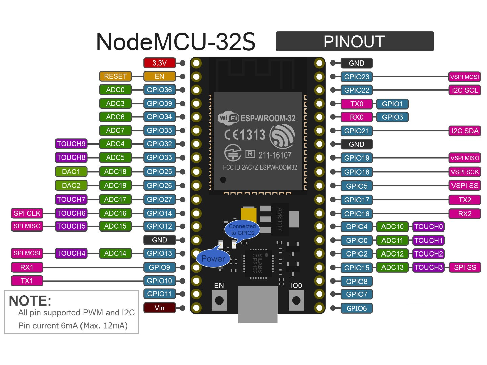

# ESP-SIO-DEV

**PROJECT IS A WORK IN PROGRESS, PIN ASSIGNMENTS MAY CHANGE**
*Pins last changed in commit on August 15th 2021*

## So what is it ?

This project uses an ESP32 connected to a SDHC sdcard to emulate a PSX memory card. The ESP's Wifi capabilities can be used to upload memory card images via a basic web interface.
An optional oled screen can be connected to display some informations.

# Software setup

1. Follow this guide to setup the ESP-IDF SDK : [https://docs.espressif.com/projects/esp-idf/en/latest/esp32/get-started/index.html](https://docs.espressif.com/projects/esp-idf/en/latest/esp32/get-started/index.html)  
2. Clone this repo : `git clone https://github.com/johnbaumann/esp-sio-dev`
3. In the 'esp-sio-dev' directory, open a terminal and [setup environnment variables](https://docs.espressif.com/projects/esp-idf/en/latest/esp32/get-started/index.html#step-4-set-up-the-environment-variables)  
4. Connect your ESP32 and type `idf.py build` to compile the project.
5. Type `idf.py -p PORT [-b BAUD] flash` to upload the binary to your ESP board (Make sure you change `PORT` to your actual com port).

You can check the serial monitor to make sure the boot process is correct using `idf.py -p PORT monitor`

## Common errors

  * Certificate error at compilation time : [certificate Error : https://github.com/espressif/esp-idf/issues/5322#issuecomment-935331910](certificate Error : https://github.com/espressif/esp-idf/issues/5322#issuecomment-935331910)  
  * Message about frequency mismatch (26Mhz vs 40Mhz) : Change XTAL frequency with `idf.py menuconfig` : *Component config –> ESP32-specific –> Main XTAL frequency to 40 Mhz* or set `CONFIG_ESP32_XTAL_FREQ_40=y` in the project's `sdkconfig` file.

## Wifi :

The default mode is Wifi client and the SSID and PSK settings are currently hardcoded. To connect to your wifi network, adapt the lines 20 and 21 in `src>wifi>client.cc` :

```c
#define EXAMPLE_ESP_WIFI_SSID "esp-sio-client"
#define EXAMPLE_ESP_WIFI_PASS "espdevrulezdude!"
```

### AP mode

You can also put it in wifi AP mode by commenting out l.102 and uncommenting l. 106 in `main.cc` :

```c
// if client settings found do this
wifi::client::Init();

// if no settings found, start access point mode
// Enable wifi scan mode, add option for wifi config from web server
//wifi::access_point::Init();
```

## SD card : 

If no SD card is found, the [spiffs](https://docs.espressif.com/projects/esp-idf/en/latest/esp32/api-reference/storage/spiffs.html) filesystem is used.

It should be noted that the spiffs filesystem has a 31 characters limitation for the whole filepath, something to bin mindfull of when uploading files via the web interface.

sources : https://discord.com/channels/642647820683444236/642848627823345684/895115268253179904

The default .mc file is currently hardcoded : 

```c
sprintf(loaded_file_path, "%s/default.mc", base_path);
LoadCardFromFile(loaded_file_path, sio::memory_card::memory_card_ram);
```  
[https://github.com/johnbaumann/esp-sio-dev/blob/7841e5fc27d4c3c45620d9c0454798e0f8cd3935/src/storage/storage.cc#L102](https://github.com/johnbaumann/esp-sio-dev/blob/7841e5fc27d4c3c45620d9c0454798e0f8cd3935/src/storage/storage.cc#L102)

### SPIFFS filesystem 

https://docs.espressif.com/projects/esp-idf/en/latest/esp32/api-reference/storage/spiffs.html

### Accessing the web interface

You can access the web interface via your web browser by enterring the IP of the ESP on your local network.
In AP mode, the default ip is `192.168.4.1`.

From there, you can browse the content of the filesystem and upload new files it.  

# Hardware setup


## Needed hardware 

  * A PSX with a serial port
  * An ESP32 board (e.g : Heltec's Wifi kit 32, Nodemcu ESP32S V.1.1, etc. )
  * An SDHC sd card + SD card adapter
  * A 0.96" oled SPI screen (e.g : SD1306)
  * A breadboard with dupont wires

## Connecting the ESP to the SD Card (SPI Mode)

### Pinout

  
  

| SD card pins | ESP32 gpio | Pull-up Resistor |
|--------------|------------|------------|
| 1 CS | GPIO 5 |
| 2 DI | GPIO 23 / MOSI | 10K to 4 VDD
| 3 GND | GND |
| 4 VDD | 3.3V |
| 5 CLK/SCK | GPIO 18 |
| 7 DO | GPIO 19 / MISO | 10K to 4 VDD

SD card pinout : [https://pinouts.ru/Memory/sdcard_pinout.shtml](https://pinouts.ru/Memory/sdcard_pinout.shtml)  

### Connecting the ESP to the oled

| ESP32 gpio | OLED pin |
|--------------|------------|
| GND  |  GND |
| 3.3V  |  VCC |
| GPIO 15  |  SCL |
| GPIO 4  |  SDA |
| GPIO 16  | RST |
| GPIO 21  | Backlight |

The default gpio configuration is for [Heltec's Wifi Kit 32](https://heltec.org/project/wifi-kit-32/) which has an integrated oled display.   

If using a different devboard and oled screen (e.g ; a [standalone SD1306](https://www.az-delivery.de/en/products/0-96zolldisplay) module), you might not have a RST and Backlight line to connect, in which case you should comment out l.16-17 in  `src/pins.h` to reflect that.
You should also edit the GPIO_NUM_X values to reflect your devboard's pinout.

```c
// OLED
const gpio_num_t kOLEDPin_SDA = GPIO_NUM_4;        // Serial Data 
const gpio_num_t kOLEDPin_SCL = GPIO_NUM_15;       // Serial Clock
//const gpio_num_t kOLEDPin_RST = GPIO_NUM_16;       // Reset
//const gpio_num_t kOLEDPin_Backlight = GPIO_NUM_21; // Backlight control
// OLED
```

You should then comment out the code making use of those ; in `src/oled/ssd1306.cc`, l.504 to 508
```c
// Reset OLED
//~ gpio_set_direction(kOLEDPin_RST, GPIO_MODE_OUTPUT);
//~ gpio_set_level(kOLEDPin_RST, 0);
//~ vTaskDelay(pdMS_TO_TICKS(100));
//~ gpio_set_level(kOLEDPin_RST, 1);
```

in `src/main.cc`, l. 72 to 75 :

```c
// Reset OLED
//~ gpio_set_direction(kOLEDPin_RST, GPIO_MODE_OUTPUT);
//~ gpio_set_level(kOLEDPin_RST, 0);
//~ vTaskDelay(pdMS_TO_TICKS(100));
//~ gpio_set_level(kOLEDPin_RST, 1);
```

#### Nodemcu ESP32S 1.1 pins

If using the  devkit, you should use those pins :

| ESP32S gpio | OLED pin |
|--------------|------------|
| GND  |  GND |
| 3.3V  |  VCC |
| GPIO 22  |  SCL |
| GPIO 21  |  SDA |

`src/pins.h` :

```c
// OLED
const gpio_num_t kOLEDPin_SDA = GPIO_NUM_21;        // Serial Data
const gpio_num_t kOLEDPin_SCL = GPIO_NUM_22;       // Serial Clock
```

### Connecting the ESP to the Playstation

You need to have a [serial port (SIO)](https://en.wikipedia.org/wiki/PlayStation_models#Comparison_of_models) on your PSX, and either use a [scph-1040](https://en.wikipedia.org/wiki/PlayStation_Link_Cable) serial cable or solder directly to the psx motherboard. See the "From the PSX to the controller" section [here for some solutions](https://unirom.github.io/serial_psx_cable).

| ESP32 gpio | PSX SIO pin |
|--------------|------------|
| 32  |  1 DATA |
| 34  |  2 CMND |
| 35  |  6 ATT  |
| 39  |  7 CLK  |
| 33  |  8 ACK  |

PSX SIO pinout : [https://psx-spx.consoledev.net/pinouts/#pinouts-sio-pinouts](https://psx-spx.consoledev.net/pinouts/#pinouts-sio-pinouts)  
