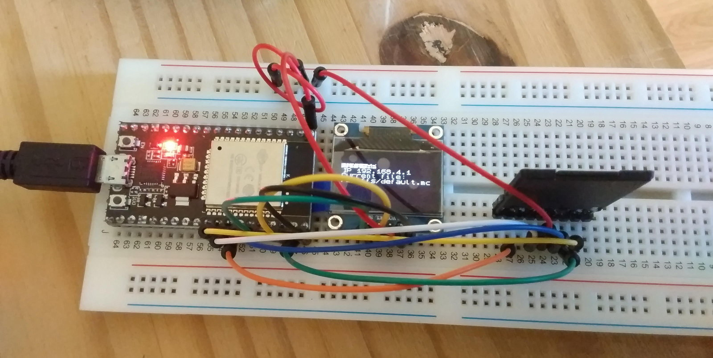
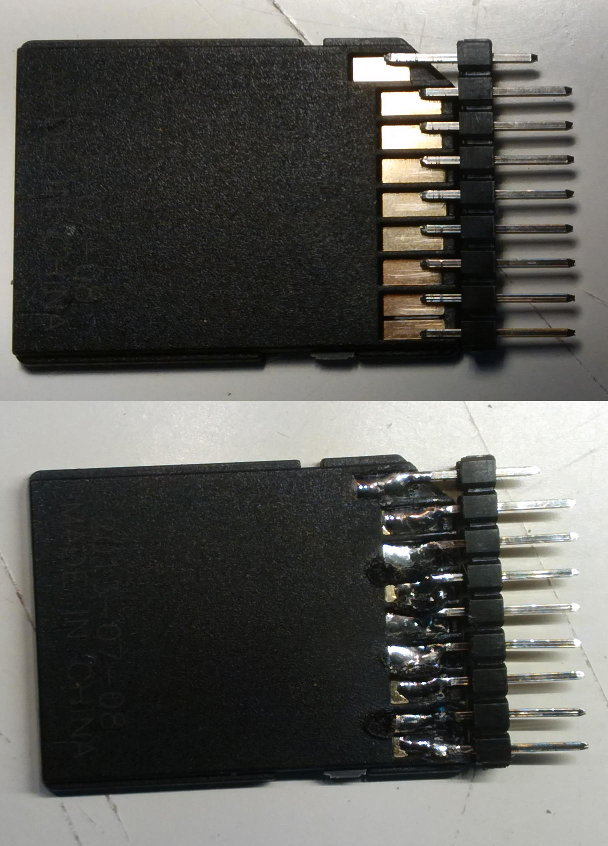
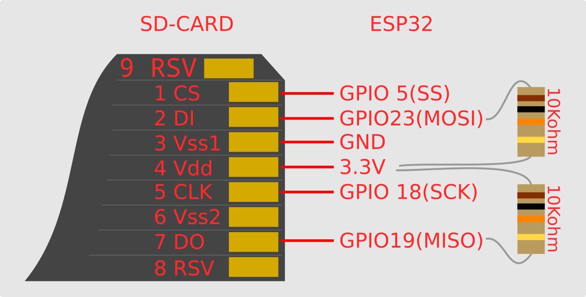
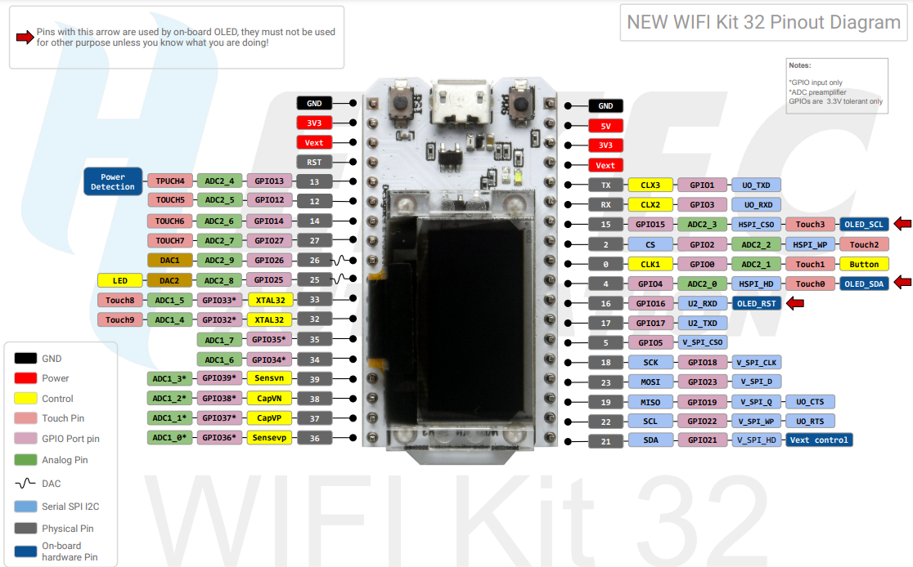
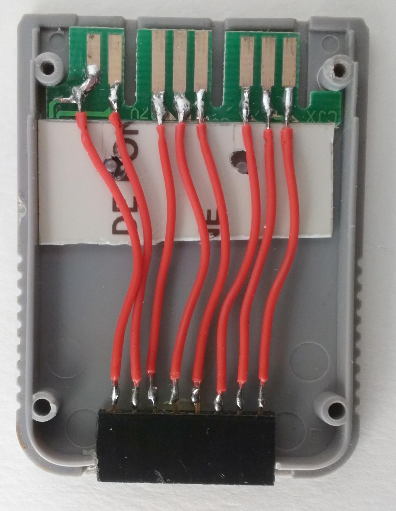
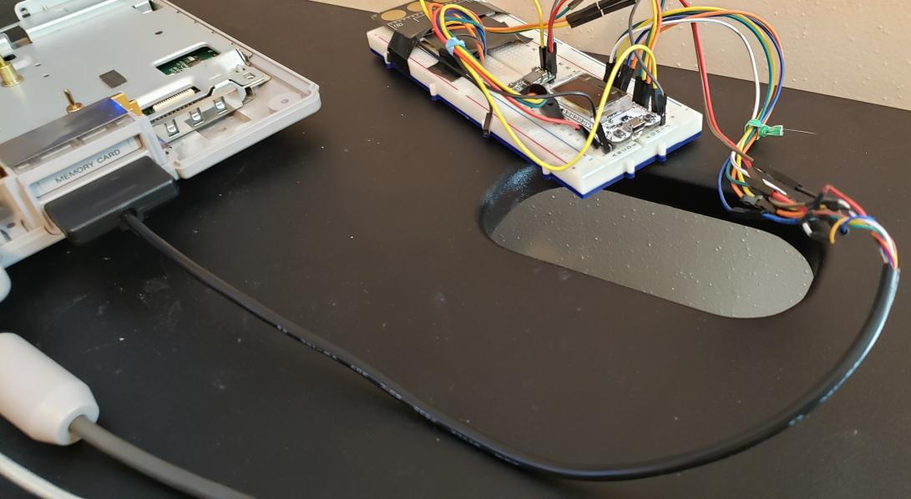
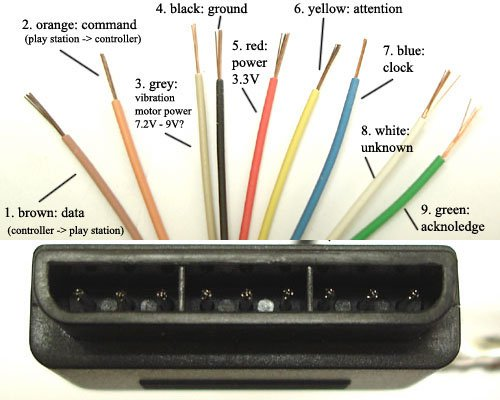

# OpenMC

**PROJECT IS A WORK IN PROGRESS, PIN ASSIGNMENTS MAY CHANGE**  
*Pins last changed in commit on August 15th 2021*

## So what is it ?

This project uses an ESP32 connected to a SDHC sdcard to emulate a PSX memory card. The ESP's Wifi capabilities can be used to upload memory card images via a basic web interface.
An optional oled screen can be connected to display some informations.

### PCB in the works

A PCB is in the works that will rely on Heltec's Wifi Kit 32 and a few additional components and will connect to the console via the memory card port.

# Software setup

1. Follow this guide to setup the ESP-IDF SDK : [https://docs.espressif.com/projects/esp-idf/en/latest/esp32/get-started/index.html](https://docs.espressif.com/projects/esp-idf/en/latest/esp32/get-started/index.html)  
2. Clone this repo : `git clone https://github.com/johnbaumann/esp-sio-dev`
3. In the 'esp-sio-dev' directory, open a terminal and [setup environnment variables](https://docs.espressif.com/projects/esp-idf/en/latest/esp32/get-started/index.html#step-4-set-up-the-environment-variables)  
4. Connect your ESP32 and type `idf.py build` to compile the project.
5. Type `idf.py -p PORT [-b BAUD] flash` to upload the binary to your ESP board (Make sure you change `PORT` to your actual com port).

You can check the serial monitor to make sure the boot process is correct using `idf.py -p PORT monitor`

## Common errors

  * Certificate error at compilation time : [https://github.com/espressif/esp-idf/issues/5322#issuecomment-935331910](https://github.com/espressif/esp-idf/issues/5322#issuecomment-935331910)  
  * Message about frequency mismatch (26Mhz vs 40Mhz) :  
  Change XTAL frequency with `idf.py menuconfig` :  
  *Component config –> ESP32-specific –> Main XTAL frequency to 40 Mhz*  
  or set `CONFIG_ESP32_XTAL_FREQ_40=y` in the project's `sdkconfig` file.
  
  The filesystem currently only supports ANSI encoded filenames, and the OLED display driver only supports the standard ASCII set.

## Wifi :

The default mode is Wifi Access Point.
The Wifi mode, SSID, and PSK settings can be loaded from the SD card via config.txt in the root directory.

## Configuration :

An example config.txt is included in this repository, modify this and copy to the root directory of your FAT32 formatted SD card.
Three settings are required to be considered a valid config: mode, ssid, and password
Valid settings for mode: ap, client
ssid should be between 1-32 characters
password should be either 0 characters(leave blank for open auth), or a password 7-63 characters long
PSK 64 digit hex passwords are not currently supported

## SD card : 

If no SD card is found, the web server will fail to start. A single file ram filesystem may be added down the road.

The default .mc file is currently hardcoded : 

```c
sprintf(loaded_file_path, "%s/default.mc", base_path);
```  
[https://github.com/johnbaumann/esp-sio-dev/blob/master/src/storage/storage.cc#L104](https://github.com/johnbaumann/esp-sio-dev/blob/master/src/storage/storage.cc#L104)

### Accessing the web interface

You can access the web interface via your web browser by enterring the IP of the ESP on your local network.
In AP mode, the default ip is `192.168.4.1`.

From there, you can browse the content of the filesystem and upload new files it.  

# Hardware setup



## Needed hardware 

  * A PSX
  * An ESP32 board (e.g : Heltec's Wifi kit 32, Nodemcu ESP32S V.1.1, etc. )
  * An SDHC sd card + SD card adapter
  * A 0.96" oled SPI screen (e.g : SD1306)
  * A breadboard with dupont wires

## Connecting the ESP to the SD Card (SPI Mode)

### Pinout

  
  

| SD card pins | ESP32 gpio | [Pull-up Resistor](https://docs.espressif.com/projects/esp-idf/en/v4.3.1/esp32/api-reference/peripherals/sd_pullup_requirements.html#sd-pull-up-requirements) |
|--------------|------------|------------|
| 1 CS | GPIO 5 |
| 2 DI | GPIO 23 / MOSI | 10K to 4 VDD
| 3 GND | GND |
| 4 VDD | 3.3V |
| 5 CLK/SCK | GPIO 18 |
| 7 DO | GPIO 19 / MISO | 10K to 4 VDD

SD card pinout : [https://pinouts.ru/Memory/sdcard_pinout.shtml](https://pinouts.ru/Memory/sdcard_pinout.shtml)  

### Connecting the ESP to the oled



| ESP32 gpio | OLED pin |
|--------------|------------|
| GND  |  GND |
| 3.3V  |  VCC |
| GPIO 15  |  SCL |
| GPIO 4  |  SDA |
| GPIO 16  | RST |
| GPIO 21  | Backlight |

The default gpio configuration is for [Heltec's Wifi Kit 32](https://heltec.org/project/wifi-kit-32/) which has an integrated oled display.   

If using a different devboard and oled screen (e.g ; a [standalone SD1306](https://www.az-delivery.de/en/products/0-96zolldisplay) module), you might not have a RST and Backlight line to connect, in which case you should comment out l.16-17 in  `src/pins.h` to reflect that.
You should also edit the GPIO_NUM_X values to reflect your devboard's pinout.

```c
// OLED
const gpio_num_t kOLEDPin_SDA = GPIO_NUM_4;        // Serial Data 
const gpio_num_t kOLEDPin_SCL = GPIO_NUM_15;       // Serial Clock
//const gpio_num_t kOLEDPin_RST = GPIO_NUM_16;       // Reset
//const gpio_num_t kOLEDPin_Backlight = GPIO_NUM_21; // Backlight control
// OLED
```

You should then comment out the code making use of those ; in `src/oled/ssd1306.cc`, l.504 to 508
```c
// Reset OLED
//~ gpio_set_direction(kOLEDPin_RST, GPIO_MODE_OUTPUT);
//~ gpio_set_level(kOLEDPin_RST, 0);
//~ vTaskDelay(pdMS_TO_TICKS(100));
//~ gpio_set_level(kOLEDPin_RST, 1);
```

in `src/main.cc`, l. 72 to 75 :

```c
// Reset OLED
//~ gpio_set_direction(kOLEDPin_RST, GPIO_MODE_OUTPUT);
//~ gpio_set_level(kOLEDPin_RST, 0);
//~ vTaskDelay(pdMS_TO_TICKS(100));
//~ gpio_set_level(kOLEDPin_RST, 1);
```

#### Nodemcu ESP32S 1.1 pins

If using the [Nodemcu ESP32S 1.1](./images/nodemcu11-esp32s.jpeg) devkit, you should use those pins :

| ESP32S gpio | OLED pin |
|--------------|------------|
| GND  |  GND |
| 3.3V  |  VCC |
| GPIO 22  |  SCL |
| GPIO 21  |  SDA |

`src/pins.h` :

```c
// OLED
const gpio_num_t kOLEDPin_SDA = GPIO_NUM_21;        // Serial Data
const gpio_num_t kOLEDPin_SCL = GPIO_NUM_22;       // Serial Clock
```

### Connecting the ESP to the Playstation

The ESP is connected to the PSX via a memory card/pad port, either via a salvaged memory card motherboard or a butchered PSX pad cable.

#### Memory card + header

<a href="./images/mc-hdr.jpg"></a>

#### PSX pad cable 

<a href="./images/pad-esp.jpg"></a><a href="./images/ps2-controller-pinout.png"></a>

| ESP32 gpio | PSX SIO pin |
|--------------|------------|
| 32  |  1 DATA |
| 34  |  2 CMND |
| GND  |  4 GND |
| 35  |  6 ATT  |
| 39  |  7 CLK  |
| 33  |  9 ACK  |

**Be mindful that ACK is pin 9 on both the memory card and pad ports, but ACK is the 8th pin of the memory card port whereas it is the 9th pin of the pad slot.**
```
_________________________
|       |       |       |
| 9 7 6 | 5 4 3 |  2 1  | CARD
|_______|_______|_______|
 _______________________
|       |       |       |
| 9 8 7 | 6 5 4 | 3 2 1 | PAD
 \______|_______|______/
```

PSX SIO pinout : [https://psx-spx.consoledev.net/pinouts/#pinouts-controller-ports-and-memory-card-ports](https://psx-spx.consoledev.net/pinouts/#pinouts-controller-ports-and-memory-card-ports)  
